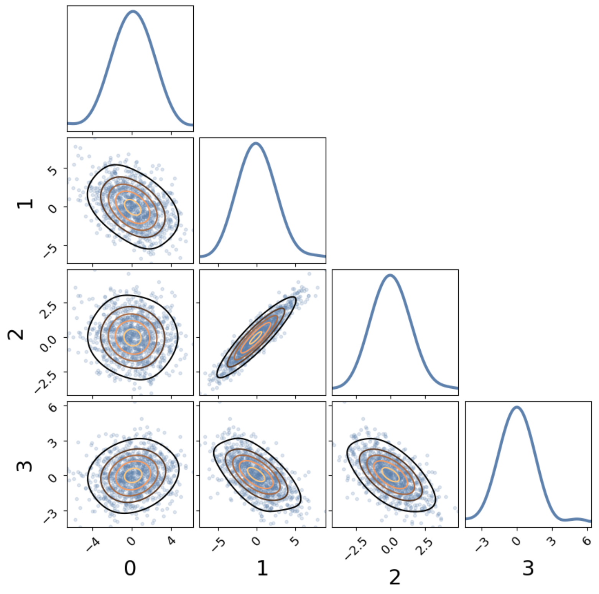

pears
=====

Make pairs plots!

.. code-block:: bash

   pip install pears

## Example

.. code-block:: python

   import pears
   cov = np.random.normal(size=(4, 4))
   cov = cov.T @ cov
   x = np.random.multivariate_normal(mean=np.zeros(4), cov=cov, size=1000)
   pears.pears(x.T)

